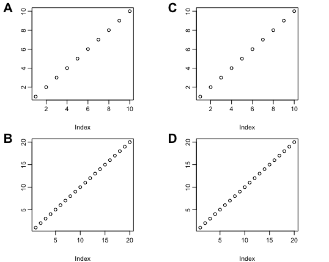
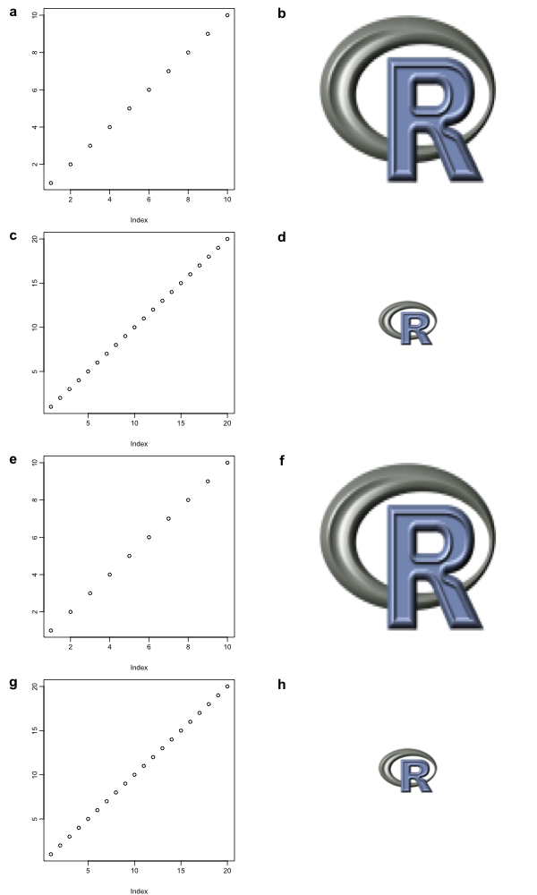
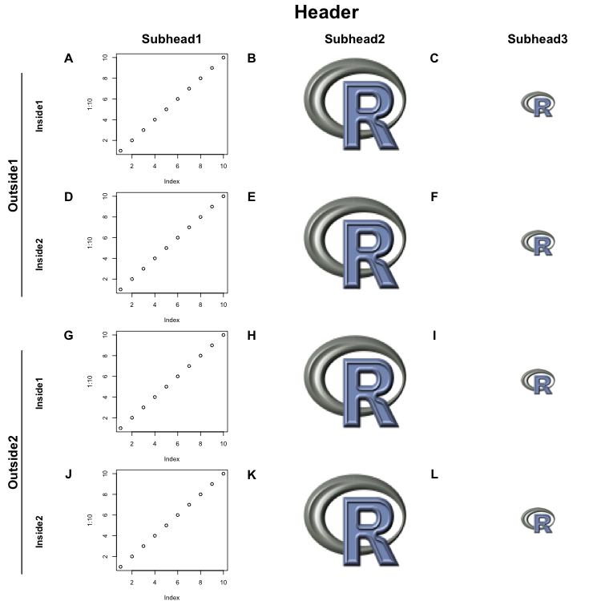

# figuReLayouts
An R-script with attempts to provide some common layouts for figure making.

This just makes use of layout and works well with base plotting.

There are a lot of other options available, but when I did an extremely short and incomplete survey/attempted to use some, it seemed they needed to be lattice or ggplot2 plots.

That observation may be wrong. Please feel free to tell me in the issues section, and I will update here to redirect any unsuspecting victims.

Having said that, this little set of functions that make use of layout() has helped me generate some nice figures.

Feel free to contribute, and I will add your name to the list of contributors.

NOTE:
Some of the boring plots with M rows and N columns (MxN) can be finagled with par(mfrow=c(M,N)). 
One can then put the letters in the upper left hand of the plot using text/mtext functions (maybe others).
This package tries to make that part of it (lettering) automated with layouts().

# Contributors
John Urban (2019)

# Example plots

